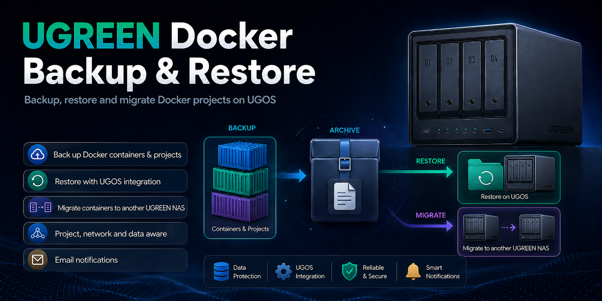

# 🚀 UGREEN NAS Docker Backup & Restore

[🇵🇱 Polska wersja](README.pl.md) · [🇩🇪 Deutsche Version](README.DE.md)



## 📦 Overview

This project provides a powerful backup, restore, and migration system for Docker projects running on UGREEN NAS with UGOS.

✔ Backup of Docker containers and projects  
✔ Restore with UGOS Docker app integration  
✔ Migration to another UGREEN NAS  
✔ Support for standalone containers  
✔ Optional SCP remote backup  
✔ Path remapping for NAS migrations  
✔ E-mail notifications  
✔ Cron job support  
✔ Optional shutdown after successful completion  
✔ English and German runtime output

---

## 📁 Repository structure

```text
UGREEN-NAS-Docker-Backup-Restore/
├── DockerBackup/
│   ├── backup-exclude-paths.txt
│   ├── dockersich.env.example
│   ├── path-remap.tsv
│   ├── ugreen-docker-backup.sh
│   └── ugreen-docker-restore.sh
│
├── Screen/
│   ├── DockerBackupPack.png
│   ├── DockerBackupPackEN.png
│   └── DockerBackupPack_1200.jpg
│
├── README.md
├── README.DE.md
├── README.pl.md
├── Changelog.txt
└── UGREEN_Docker_BR_DE_EN.pdf
```

---

## ⚙️ Installation

### 1. Create a shared folder in UGOS

In the UGOS **Files** app, create a shared folder named **DockerBackup**.

Example:

```text
/volume2/DockerBackup
```

Notes:
- Keep the recycle bin disabled for this share.
- Make sure administrators have read and write permissions.
- The share may also be located on another volume, such as `/volume1` or `/volume3`.

---

### 2. Copy the files

Copy the contents of:

```text
DockerBackup/
```

to:

```text
/volume2/DockerBackup
```

---

### 3. Set permissions

```bash
cd /volume2/DockerBackup
cp dockersich.env.example dockersich.env
chmod +x ugreen-docker-backup.sh ugreen-docker-restore.sh
```

---

### 4. Adjust the configuration

Configuration file:

```text
/volume2/DockerBackup/dockersich.env
```

For a first test, beginners should review at least these values:

```bash
LANGUAGE=en
HOST_LABEL="UGREEN NAS"
SOURCE_DIR=auto
BACKUP_DIR=/volume2/DockerBackup
SEND_MAIL=false
DRY_RUN=true
```

Important notes:
- `SOURCE_DIR=auto` automatically detects the Docker project directory.
- `DOCKER_ROOT_DIR=auto` automatically detects the Docker data directory.
- `UGOS_DOCKER_DB=auto` automatically detects the UGOS Docker database.
- `DRY_RUN=true` is strongly recommended for the first restore test.

---

## 🗂️ Important options

### Base settings and paths

- `LANGUAGE` = output, log, and mail language (`en` or `de`)
- `HOST_LABEL` = display name of the NAS in logs and e-mails
- `SOURCE_DIR` = Docker project directory, usually detected automatically
- `BACKUP_DIR` = destination directory for archives, logs, and temporary files
- `TEMP_DIR` = temporary working directory
- `LOG_DIR` = directory for backup and restore logs

### Backup behavior

- `BACKUP_ALL_PROJECTS=true` = back up all detected Docker projects
- `INCLUDE_PROJECTS` = back up only selected projects
- `EXCLUDE_PROJECTS` = exclude selected projects from the backup
- `BACKUP_STANDALONE_CONTAINERS=true` = also back up containers without a Compose project
- `STOP_CONTAINERS=true` = briefly stop running containers before backup
- `BACKUP_EXCLUDE_PATHS_FILE=backup-exclude-paths.txt` = exclusion list for large cache directories

### Additional backup content

- `BACKUP_IMAGES=false` = additionally back up Docker images
- `BACKUP_NAMED_VOLUMES=false` = additionally back up named volumes
- `BACKUP_EXTERNAL_BINDS=false` = additionally back up external bind mounts

### Restore behavior

- `DRY_RUN=true` = simulate the restore without making changes
- `RESTORE_ALL_PROJECTS=false` = perform a targeted restore instead of restoring everything
- `RESTORE_PROJECTS` = restore only selected projects
- `RESTORE_OVERWRITE_EXISTING=false` = do not overwrite existing target directories
- `RESTORE_STANDALONE_CONTAINERS=true` = also restore standalone containers
- `ENABLE_PATH_REMAP=true` = remap paths when migrating to another NAS
- `PATH_REMAP_FILE=path-remap.tsv` = source-to-target path mapping file
- `UPDATE_UGOS_DOCKER_DB=true` = update the UGOS Docker app database
- `REFRESH_UGOS_DOCKER_APP=true` = refresh the Docker app service after restore

### Notifications and remote backup

- `SEND_MAIL=true|false` = enable or disable e-mail notifications
- `MAIL_NOTIFY_ON=all|success|fail|none` = select when notifications are sent
- `ENABLE_REMOTE_BACKUP=true|false` = additionally copy the archive to another system via SCP
- `REMOTE_HOST`, `REMOTE_USER`, `REMOTE_PORT`, `REMOTE_PATH` = remote backup destination

---

## 🔄 Run a backup

```bash
cd /volume2/DockerBackup
./ugreen-docker-backup.sh
```

The script:
- automatically detects Docker paths,
- selects projects according to the configuration,
- optionally stops running containers for a short time,
- creates a compressed archive,
- restarts containers that were running before the backup,
- optionally sends status e-mails.

---

## ♻️ Run a restore

Always test a restore in dry-run mode first:

```bash
cd /volume2/DockerBackup
./ugreen-docker-restore.sh /volume2/DockerBackup/ugreen-docker-backup_YYYY-MM-DD_HH-MM-SS.tar.gz
```

For the first test, set in `dockersich.env`:

```bash
DRY_RUN=true
```

For an actual restore later:

```bash
DRY_RUN=false
```

For safety, the script then asks you to enter:

```text
RESTORE
```

---

## 🔁 Migrate containers to another UGREEN NAS

The package can also be used to migrate Docker projects to another UGREEN NAS.

Typical workflow:
1. Create a backup on the source NAS.
2. Copy the archive to the target NAS.
3. Adjust `path-remap.tsv` if required.
4. Run the restore on the target NAS.
5. Let the script synchronize the restored projects with the UGOS Docker app automatically.

This allows project directories, Compose projects, and optionally additional Docker data to be transferred cleanly to the target system.

---

## 🧩 Standalone containers

Containers without a Docker Compose project label can automatically be backed up as separate projects.

Example:

```text
ubuntu-1 -> standalone_ubuntu-1
```

During restore, a Compose project is generated for the container and integrated into the UGOS Docker app.

---

## ⏱️ Configure a cron job

```bash
crontab -e
```

Example:

```bash
30 3 * * 0 cd /volume2/DockerBackup && /volume2/DockerBackup/ugreen-docker-backup.sh >> /volume2/DockerBackup/cron.log 2>&1
```

➡️ Runs every Sunday at 03:30.

---

## 📦 Features

- Back up all or selected Docker projects
- Restore individual or multiple projects
- Migrate to another UGREEN NAS
- Automatically detect Docker paths
- Restore with UGOS Docker app synchronization
- Support standalone containers
- Exclude large cache directories
- Optional backup of images, named volumes, and external bind mounts
- SCP-based remote backup
- Path remapping for different target paths
- E-mail notifications on start, success, and failure
- Logging and cron operation

---

## 📘 Manual

Included in the repository:

```text
UGREEN_Docker_BR_DE_EN.pdf
```

The manual contains step-by-step information for installation, configuration, backup, restore, and migration in German and English.

---

## 🛠️ Troubleshooting

| Problem | Solution |
|---|---|
| Script does not start | Check `chmod +x` permissions |
| No e-mail is sent | Check SMTP settings and `MAIL_NOTIFY_ON` |
| No projects are selected | Check `BACKUP_ALL_PROJECTS`, `INCLUDE_PROJECTS`, and `EXCLUDE_PROJECTS` |
| Archive becomes very large | Review `backup-exclude-paths.txt` and exclude cache paths |
| Restored project does not appear in UGOS | Use `REFRESH_UGOS_DOCKER_APP=true` or redeploy the project in UGOS |
| `scp` fails | Use `scp -O` for manual tests |

---

## ⚠️ Disclaimer

This project is a community solution and is not an official UGREEN product.
Use it at your own risk.

---

## 👨‍💻 Author

Roman Glos  
UGREEN NAS Community

---

## ⭐ Support

If you find this project useful:

- Give it a ⭐ on GitHub.
- Feedback is welcome.
- Improvement suggestions and real-world testing help the project evolve.
